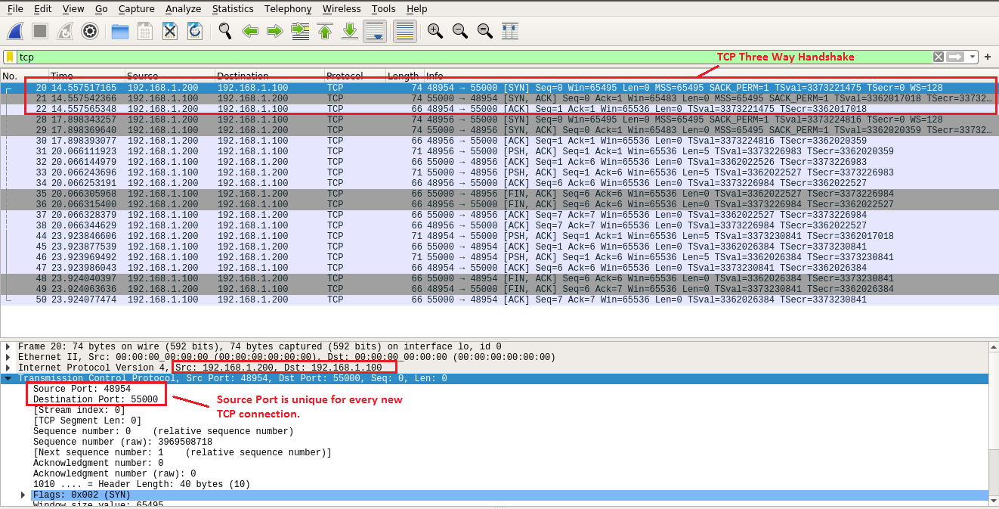
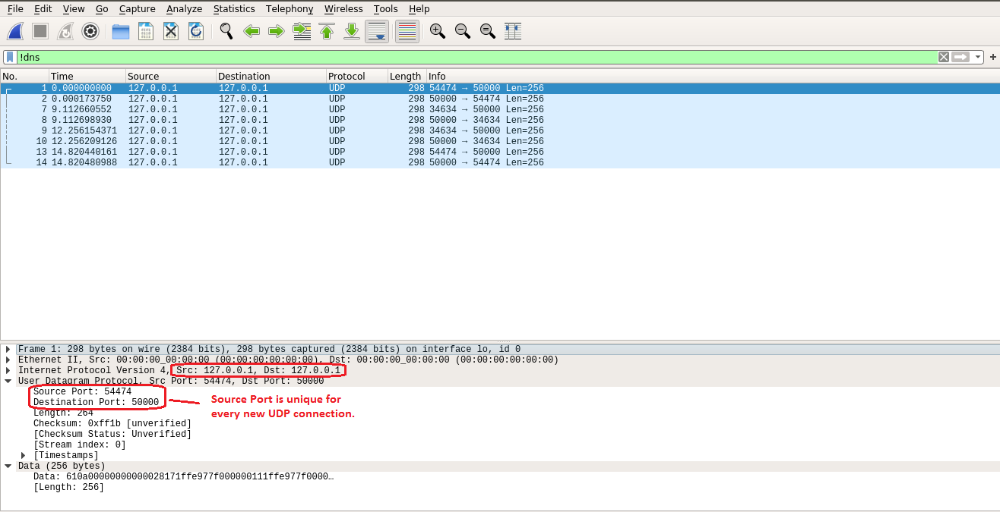

# Wireshark Captures

This document contains Wireshark captures for better understanding of the TCP/UDP concepts viz. TCP three way handshake, TCP packet format, UDP packet format etc.

## Transmission Control Protocol (TCP)

TCP provides a connection-oriented, reliable, byte stream service. The term connection oriented means that the two applications using TCP must establish a TCP connection by contacting each other before they can exchange data. When running the TCP server client, we may see some of the following messages.

* SYN: Synchronize sequence numbers to initiate a connection
* ACK: Acknowledgment
* RST: Reset the connection usually because of error
* FIN: Sender of the segment is finished sending data to its peer

Figure 1 and figure 2 shows the message flow between TCP server and TCP client in blocking mode and non-blocking mode respectively running on the same machine with Loopback IP (127.0.0.1) address.

Figure 1: TCP Server and TCP Client Communication on Loopback IP address in Blocking Mode

Figure 2: TCP Server and TCP Client Communication on Loopback IP address in Non-Blocking Mode

Also, we can show communication between TCP Server and TCP Client running on same machine but having different IP addresses with the help of VLAN.

Figure 3: TCP Server and TCP Client Communication with two different IP addresses in Blocking Mode

Figure 4: TCP Server and TCP Client Communication with two different IP addresses in Non-Blocking Mode

## User Datagram Protocol (UDP)

UDP is a simple, datagram-oriented, transport layer protocol that preserves message boundaries. It is connectionless protocol which do not guarantee delivery of data i.e. it provides best effort delivery of data. It does not provide error correction, sequencing, duplicate elimination, flow control or congestion control. It can provide error detection, and it includes the first true end to end checksum at the transport layer.

Figure 5 and figure 6 shows the message flow between UDP server and UDP client in blocking mode and non-blocking mode respectively running on the same machine with Loopback IP (127.0.0.1) address.

Figure 5: UDP Server and UDP Client Communication on Loopback IP address in blocking mode

Figure 6: UDP Server and UDP Client Communication on Loopback IP address in non-blocking mode

Also, we can show communication between UDP Server and UDP Client running on same machine but having different IP addresses with the help of VLAN.

**[Image to be uploaded soon]**

Figure 7: UDP Server and UDP Client Communication with two different IP addresses in blocking-mode

**[Image to be uploaded soon]**

Figure 8: UDP Server and UDP Client Communication with two different IP addresses in blocking-mode
